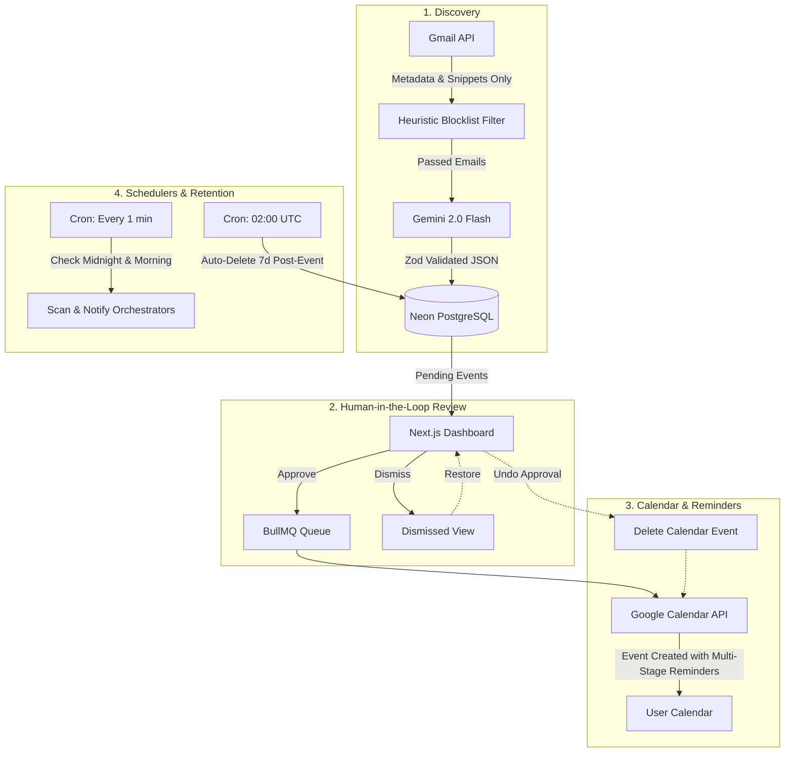

# ⚡ Nudge

> **The intelligent, privacy-first email-to-calendar assistant that ensures you never miss a deadline, interview, assessment, or flight.**

[](https://pnpm.io/)
[](https://nestjs.com/)
[](https://nextjs.org/)
[](https://prisma.io/)
[](https://aistudio.google.com/)
[](https://bullmq.io/)
[](https://www.typescriptlang.org/)

---

## 📖 Overview

**Nudge** autonomously scans your incoming emails for actionable events—such as technical assessments, job interviews, flight itineraries, doctor appointments, and project deadlines. 

Instead of cluttering your calendar with automated guesswork, Nudge places **humans in the loop**:
1. It analyzes message **metadata and snippets only** (zero full-body email storage).
2. It classifies events using **Google Gemini 2.0 Flash** with strict structured output schemas.
3. It presents detected events on a streamlined dark-mode dashboard for your **Approval** or **Dismissal**.
4. Upon approval, Nudge syncs the event to **Google Calendar** with an aggressive, customizable multi-stage reminder cadence (`3d, 1d, 1h, 30m, 5m`).
5. Made a mistake? Hit **Undo** at any time to remove the Google Calendar entry and return the event to pending.

---

## ✨ Key Features

- 🛡️ **Privacy by Design**:
  - **Zero Email Body Ingestion**: Only subject lines, sender metadata, and short snippet previews are evaluated.
  - **AES-256-GCM Token Encryption**: All Google OAuth access and refresh tokens are encrypted at rest with authenticated encryption.
  - **Automated 7-Day Purge**: Detected events and scan logs are automatically expunged from the database 7 days post-event date.

- 🤖 **Gemini 2.0 Flash Classification Pipeline**:
  - Schema-enforced structured JSON output via Zod validation.
  - Automatic hallucination & past-date rejection.
  - Confidence scoring threshold (defaults to `>= 0.75`).
  - Heuristic pre-filtering blocks marketing newsletters, receipts, notifications, and social spam before ever calling the LLM.

- 📅 **Google Calendar Sync & Instant Undo**:
  - Direct sync to the user's primary Google Calendar.
  - Exponential backoff retry queue via BullMQ.
  - Full bidirectional undo: undoing an approval deletes the created calendar event and restores the card back to the pending queue.

- 🌍 **Timezone-Aware Orchestrations**:
  - **Nightly Scan Engine**: Runs a 60-second cron check matching users crossing their local midnight. Advanced cursor pointers guarantee **zero double-scanning**.
  - **Morning Digest Orchestrator**: Sends a personalized morning briefing via Resend and Web Push at the user's configured hour (e.g. 08:00 AM).

- 🎨 **Modern Minimalist UI**:
  - Built with Next.js 15 App Router, React 19, and tailored dark-mode design tokens.
  - Interactive radar scanner onboarding screen with real-time backfill progress polling.
  - Dedicated views for **Pending**, **Dismissed** (with 1-click restore), and **History**.
  - Timezone selector, notification time picker, and custom reminder chip manager.

---

## 🏗️ Architecture & Monorepo Structure

Nudge is organized as a clean `pnpm` monorepo:

```
nudge/
├── apps/
│   ├── api/                   # NestJS 11 REST API & Background Orchestrator
│   │   ├── prisma/            # Prisma 7 schema & PostgreSQL adapter config
│   │   ├── src/
│   │   │   ├── common/        # AES-256 crypto, timezone math, utilities
│   │   │   ├── modules/
│   │   │   │   ├── ai/        # Gemini 2.0 Flash prompt, schema & service
│   │   │   │   ├── auth/      # Google OAuth 2.0 & JWT authentication
│   │   │   │   ├── calendar/  # Google Calendar API integration & BullMQ jobs
│   │   │   │   ├── events/    # Detected events CRUD & approval workflow
│   │   │   │   ├── gmail/     # Gmail metadata fetcher & spam heuristic filters
│   │   │   │   ├── notifications/ # Resend emails & Web Push (VAPID)
│   │   │   │   ├── scanner/   # Initial onboarding backfill & scan logs
│   │   │   │   ├── scheduler/ # Nightly scan, morning digest & auto-delete sweeps
│   │   │   │   └── settings/  # User preferences & reminder defaults
│   │   │   └── prisma/        # PrismaService with @prisma/adapter-pg
│   │   └── test/              # Vitest unit test suites & E2E specs
│   └── web/                   # Next.js 15 App Router Web App
│       ├── app/               # Landing page, dashboard, onboarding, settings
│       ├── components/        # EventCard, Navbar, EmptyState
│       ├── lib/               # Web Push service worker registration & helpers
│       └── public/            # Static assets & sw.js service worker
├── docs/
│   ├── DEVELOPER_GUIDE.md     # Comprehensive pnpm setup & dev cheat sheet
│   └── DEPLOYMENT_GUIDE.md    # Production deployment guide (Oracle Cloud VM + Ubuntu)
├── packages/
│   └── shared/                # Shared TypeScript types, enums & interfaces
├── pnpm-workspace.yaml        # Workspace configuration
└── render.yaml                # Render Blueprint (Legacy/interim; pending Phase 2 decommission)
```

---

## 🔄 System Flowchart



---

## 🚀 Getting Started

### Prerequisites

- **Node.js**: `v22.0.0` or higher
- **pnpm**: `v12.0.0` or higher (`npm install -g pnpm`)
- **Neon PostgreSQL**: A free serverless PostgreSQL database ([neon.tech](https://neon.tech))
- **Upstash Redis**: A serverless Redis instance with TLS ([upstash.com](https://upstash.com))
- **Google Cloud Console**: An OAuth 2.0 Client with Gmail and Google Calendar scopes enabled
- **Google AI Studio**: A Gemini API key ([aistudio.google.com](https://aistudio.google.com/))
- **Resend**: An API key for transactional emails ([resend.com](https://resend.com/))

---

### 1. Clone & Install

```bash
git clone https://github.com/yourusername/nudge.git
cd nudge
pnpm install
```

> **Note for pnpm v12 users:** If prompted by pnpm regarding native build scripts (e.g. `@prisma/engines`, `sharp`), simply run `pnpm approve-builds --all`.

---

### 2. Environment Configuration

#### A. Backend API (`apps/api/.env`)
Copy the template and fill in your keys:
```bash
cp apps/api/.env.example apps/api/.env
```

| Variable | Description |
| :--- | :--- |
| `DATABASE_URL` | Neon pooled connection string (`postgresql://...?sslmode=require`) |
| `JWT_SECRET` | 64-character random string (`openssl rand -hex 64`) |
| `ENCRYPTION_KEY` | 32-byte hex string for AES-256 (`openssl rand -hex 32`) |
| `GOOGLE_CLIENT_ID` | OAuth 2.0 Web Client ID from Google Cloud Console |
| `GOOGLE_CLIENT_SECRET`| OAuth 2.0 Client Secret |
| `GOOGLE_CALLBACK_URL` | `http://localhost:3001/auth/google/callback` |
| `GEMINI_API_KEY` | API key from Google AI Studio |
| `REDIS_URL` | Upstash Redis connection string (`rediss://...`) |
| `RESEND_API_KEY` | Resend API key (`re_...`) |
| `RESEND_FROM_EMAIL` | Verified sending domain (e.g. `nudge@yourdomain.com`) |
| `VAPID_PUBLIC_KEY` | Web Push VAPID public key |
| `VAPID_PRIVATE_KEY` | Web Push VAPID private key |

#### B. Frontend Web (`apps/web/.env.local`)
```bash
cp apps/web/.env.example apps/web/.env.local
```

| Variable | Description |
| :--- | :--- |
| `NEXT_PUBLIC_API_URL` | Backend URL (`http://localhost:3001` for local dev) |
| `NEXT_PUBLIC_VAPID_PUBLIC_KEY` | Matches `VAPID_PUBLIC_KEY` from the backend |

---

### 3. Database Setup

Generate the Prisma Client and run migrations:

```bash
pnpm prisma:migrate
```

---

### 4. Run Development Servers

Run both services in parallel or in separate terminals:

```bash
# Terminal 1: NestJS API (Port 3001)
pnpm dev:api

# Terminal 2: Next.js Frontend (Port 3000)
pnpm dev:web
```

Visit [`http://localhost:3000`](http://localhost:3000) to open the Nudge landing page and log in with Google!

---

## 🧪 Testing & Quality Assurance

Nudge includes automated unit test suites and end-to-end integration specifications:

```bash
# Run unit tests (Vitest)
pnpm --filter @nudge/api test

# Run End-to-End integration tests
pnpm --filter @nudge/api run test:e2e

# Run linter across all workspaces
pnpm lint

# Validate production builds
pnpm build:api
pnpm build:web
```

---

## 🚢 Deployment

Nudge's production infrastructure is designed for 24/7 continuous operation:

- **Backend API & Background Schedulers**: Deployed on a self-managed **Ubuntu Linux VM on Oracle Cloud Infrastructure (OCI) Always Free tier** (`systemd` + Nginx reverse proxy). This ensures 24/7 uptime without cold starts or sleeping instances, guaranteeing reliable 60-second midnight email scans and morning notification sweeps.
- **Database**: Serverless PostgreSQL via **Neon** (pooled SSL connection).
- **Queue & Cache**: Serverless Redis with TLS via **Upstash** (BullMQ job processing).
- **Frontend**: Configured for **Vercel** (`apps/web/vercel.json`), with self-hosting on the OCI VM as an open architectural option.
- **Legacy Blueprint**: `render.yaml` remains in the repository as an interim configuration file and will be decommissioned in Phase 2.

For the step-by-step server provisioning runbook, systemd service units, Nginx reverse proxy configuration, and production operations checklist, refer to the **[Deployment Guide](docs/DEPLOYMENT_GUIDE.md)**.

---

## 🔒 Security & Privacy Policy

- **Snippet-Only Access**: Nudge requests the minimum viable Gmail API scopes (`gmail.readonly`, `calendar.events`) and restricts retrieval to email metadata and short snippet previews. Full message bodies are never downloaded, processed by LLMs, or persisted.
- **Encrypted Credentials**: Tokens are safeguarded using authenticated AES-256-GCM encryption with 16-byte initialization vectors and auth tags.
- **Data Retention**: Under our automated data retention lifecycle, all processed events, logs, and metadata are automatically purged 7 days after the event timestamp.

---

## 📚 Documentation

- [Developer Setup & Architecture Guide](docs/DEVELOPER_GUIDE.md)
- [Production Deployment Guide](docs/DEPLOYMENT_GUIDE.md)

---

## 📄 License

[MIT](LICENSE) © [Shekinah](https://github.com/i-am-Shekinah)
